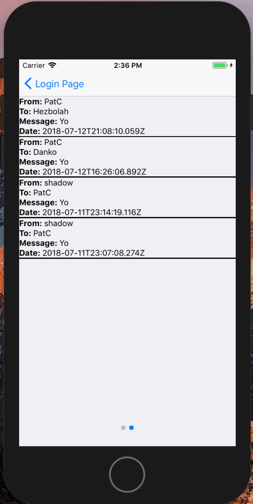

# Yo Clone App

This is a simplified clone of the Yo app that lets you send a simple "Yo" message to friends. The app was built using React Native and Expo XDE for compatibility with iOS and Android. The app features pull-to-refresh, swipe gesture to move between screens, and persistent login.

It references an API built by Horizons School of Technology.

## Screenshots

### Homepage

### Register Page

### Login Page

### User Page: click on user to send message

### Messages Page

